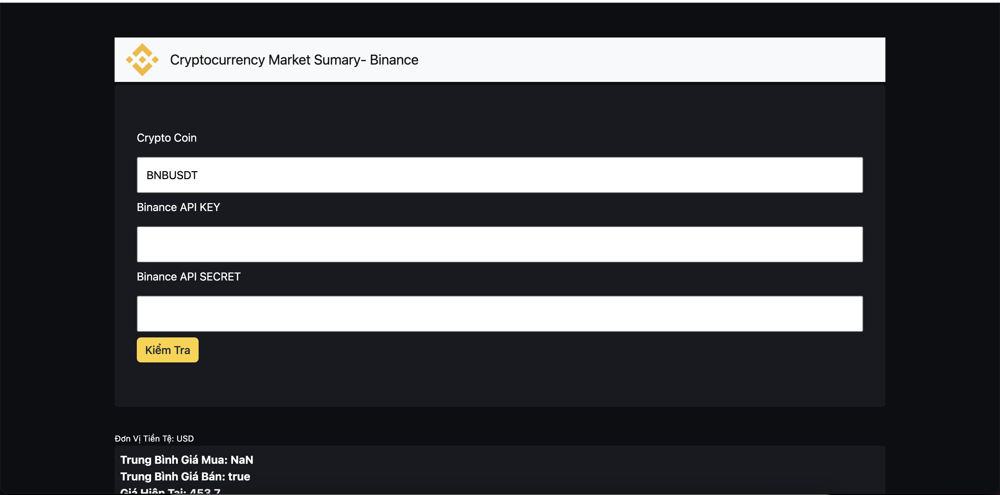

# binance-trade-sumary

To analyse trades done by user on Binance cryptocurrency trading platform and generate summary of the trade for tax and reporting.


## 1. Create Binance API 

## 2. Run local
```
  - Node version: 12.18.1 
  - create file .env: (format .env.template)
  - Start server: node app.js or yarn start
```
## 3. Demo

